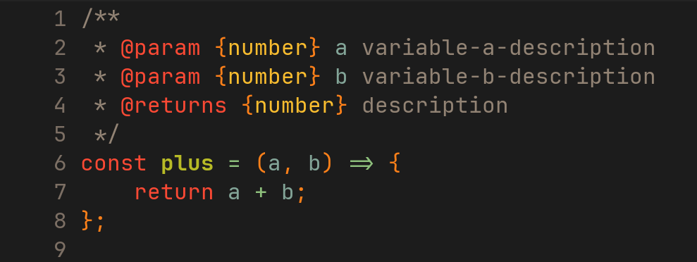
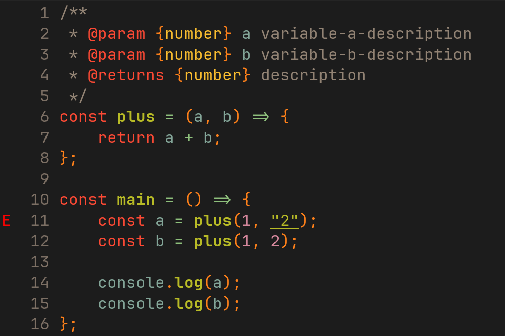
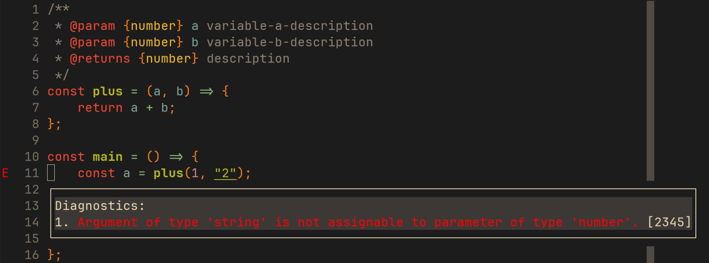

# Why JSDoc
Hi mọi người, nếu mọi người từng gặp khó khăn khi thêm type vào dự án JavaScript cũ, hoặc muốn code nhanh mà vẫn có typecheck, JSDoc là một lựa chọn đáng cân nhắc. Dưới đây là một số chia sẻ thực tế và hữu ích về JSDoc được đúc kết qua các dự án cá nhân và thử nghiệm.

---

## JSDoc là gì? (AI generated)
**JSDoc** là một chuẩn chú thích (annotation) trong JavaScript giúp mô tả kiểu dữ liệu, tham số, hàm, lớp hoặc giá trị trả về. Nó hoạt động thông qua các comment đặc biệt, cho phép trình soạn thảo hoặc công cụ biên dịch hiểu được kiểu dữ liệu để:
- Gợi ý code thông minh (IntelliSense) và autocompletion trong editor
- Kiểm tra kiểu dữ liệu cơ bản (type checks)
- Sinh tài liệu tự động từ code (yêu cầu sử dụng plugin hoặc package)

> Tóm lại: JSDoc chỉ là comment trong file .js nhưng editor có thể hiểu và thực hiện lint (hiển thị trực tiếp các lỗi type trên editor), đồng thời có thể dùng tsc để kiểm tra kiểu dữ liệu tương tự như các file .ts.

---

## Tại sao chúng ta muốn sử dụng JSDoc?
- Muốn code nhanh, không cần build, không muốn chuyển sang TypeScript
- Dự án cũ, legacy, muốn bổ sung type mà không cần thay đổi cấu trúc
- Team muốn có kiểm tra kiểu dữ liệu, autocompletion mà không cần đổi sang .ts
- Những ai thích sự đơn giản nhưng vẫn muốn code có type

---

## Tại sao chọn JSDoc thay cho TypeScript?
- Không cần file `.ts`, không cần build, code vẫn chạy trực tiếp với Node.js hoặc trình duyệt
- Không cần bước compile, không gặp lỗi build phải restart server
- Dễ dàng thêm types vào dự án JavaScript, đặc biệt là những dự án cũ
- Hỗ trợ kiểm tra kiểu dữ liệu và autocompletion tương tự như TypeScript

---

## Hướng dẫn sử dụng JSDoc để thay thế TypeScript

- Cài đặt JSDoc hoặc cấu hình để editor hiểu và hiển thị lint/diagnostic
- Sử dụng file .tsconfig.json và các file .d.ts (chỉ định thông qua tsconfig.json - `compilerOptions.types`)
- Ví dụ:

```json
// tsconfig.json
{
    "compilerOptions": {
        "allowJs": true,              // Cho phép file JavaScript được include
        "checkJs": true,              // Bật kiểm tra kiểu dữ liệu cho file JS
        "noEmit": true,               // Không sinh file build
        "types": ["node", "./types"], // Kiểm tra kiểu dữ liệu qua types.d.ts
        "moduleResolution": "node",   // Dùng Node.js module resolution
        "resolveJsonModule": true,
        "module": "ESNext",
        "target": "ESNext"
    },
    "include": ["**/*.js"],           // Kiểm tra kiểu dữ liệu toàn bộ file JS
    "exclude": [
        "node_modules",
        "dist",
        "tests"
    ]
}
```

Ví dụ về setup type cơ bản cho project Express
```typescript
// types.d.ts

export { };

// global types
declare global {
    type SocketSharedState = {
        boardIdMap: Map<string, string>;
    }
    type Guest = {
        ip: string;
        isUser: boolean;
    }
}

// augmented types for express.Request
declare module 'express' {
    interface Request {
        user?: {
            userId: string;
            username: string;
            refreshTokenVersion?: number;
        };
        file?: Express.Multer.File; // express's multer - https://www.npmjs.com/package/multer
    }
}

// augmented types Socket
declare module "socket.io" {
  interface Socket {
    user?: {
      id: string;
      username: string;
    };
  }
}
```

---

## Một số lưu ý và mẹo về JSDoc
- Có thể dùng JSDoc để tạo doctype tự động cho project, khá tiện
- Dùng JSDoc kết hợp với VSCode sẽ có autocompletion và kiểm tra kiểu dữ liệu (hay gọi là linter - inlay hints - diagnostic, code editor nào cũng support thì phải em không sure lắm...)
- Có thể dùng tsc để kiểm tra kiểu dữ liệu cho file JS nhờ JSDoc (xem thêm ở nội dung setup/config ở phần tiếp theo)
- JSDoc không chỉ dành cho JS, mà còn dùng được cho các file .ts nếu cần (typescript thì có TSDoc nữa, cũng tương tự như JSDoc, mà nội dung chủ yếu là skip typescript typecheck nên mình bỏ qua nha mọi người)

---

## Các syntax thông dụng
```javascript
@param {type} name - Description: Defines a parameter.
@returns {type} Description: Specifies return value.
@type {typeName}
@async: Marks an async function.
@typedef {type} Name: Defines a custom type.
@example: Shows usage, e.g., @example add(2, 3); // 5.
```

```javascript
/**
 * Adds two numbers.
 * @param {number} a - First number.
 * @param {number} b - Second number.
 * @returns {number} The sum.
 */
function add(a, b) {
  return a + b;
}
```

```javascript
/**
 * A point in 2D space.
 * @class
 * @param {number} x - X-coordinate.
 * @param {number} y - Y-coordinate.
 */
class Point {
  constructor(x, y) {
    this.x = x;
    this.y = y;
  }

  /**
   * Gets distance to another point.
   * @param {Point} other - Another point.
   * @returns {number} Distance.
   */
  distanceTo(other) {
    return Math.sqrt((this.x - other.x) ** 2 + (this.y - other.y) ** 2);
  }
}
```

```javascript
const a = /** @type number */10;
const b = /** @type string */"hello world";
const c = /** @type any */undefined;
```

```javascript
/**
 * @template T
 * @param {T[]} arr
 * @returns {T}
 * @throws {Error} Nếu mảng rỗng
 * @example
 * max([1,2,3]) // 3
 */
function max(arr) {
  if (arr.length === 0) throw new Error('Empty array');
  return Math.max(...arr);
}
```

```javascript
/**
 * @enum {string}
 */
const Status = {
  ACTIVE: 'active',
  INACTIVE: 'inactive',
  PENDING: 'pending'
};
```

---

## JSDoc hoạt động và tương tác trong editor
> Em dùng neovim + typescript-language-server, tương tự như các editor khác như vscode/vscode-based thì cũng có built-in language server nên sẽ support linter/inlay-hint/diagnostic hết

> Khai báo một function đơn giản với JSDoc


> Editor show diagnostic khi truyền sai type (line 11)



---

## Lợi ích của JSDoc
- **Hỗ trợ refactor code**: Khi code có JSDoc, IDE sẽ tự động gợi ý và kiểm tra type khi refactor, giảm lỗi runtime.
- **Tài liệu API luôn cập nhật**: Tài liệu sinh tự động từ code, không lo bị outdated.
- **Dễ dàng onboarding cho thành viên mới**: Chỉ cần đọc tài liệu sinh từ JSDoc là hiểu ngay cấu trúc và cách dùng API.

---

## Tips

- Điểm bất lợi nhất của JSDoc so với Typescript mà em nhận thấy dễ nhất là số cú pháp khá dài và bất tiện, nên ở editor của mọi người hãy setup `snippet` cho việc autogenerate các comment jsdoc

---

## Nguồn em tham khảo
- [JSDoc - Getting Started](https://jsdoc.app/about-getting-started)
- [Types via JSDoc or TypeScript?](https://deliciousreverie.co.uk/posts/types-via-jsdoc-or-typescript/)
- [How JSDoc Saved My Dev Workflow](https://spin.atomicobject.com/how-jsdoc-saved-my-dev-workflow/)

---

## Tổng kết

- Theo ý kiến cá nhân của em thì mọi người (rất)nên sử dụng JSDoc thay cho Typescript cho các dự án cá nhân (không quá lớn), hoặc muốn nâng cấp dự án pure javascript nào đó bằng cách thêm một số typecheck cho các feature quan trọng - do tính chất nhỏ gọn và dễ setup
- Về tính chất thì typescript và jsdoc đều share chung một typecheck system (chúng ta có thể ngầm hiểu điều đó thông qua việc sử dụng `tsc` để run typecheck, xem ví dụ ở folder `express`)
- JSDoc support hầu như đa phần các type tương tự typescript (từ type cơ bản cho đến generic types)
- Thông tin chi tiết hơn có thể xem thêm ví dụ ở folder `express`
