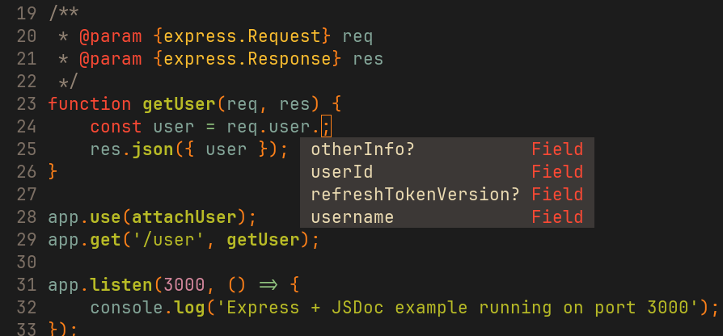
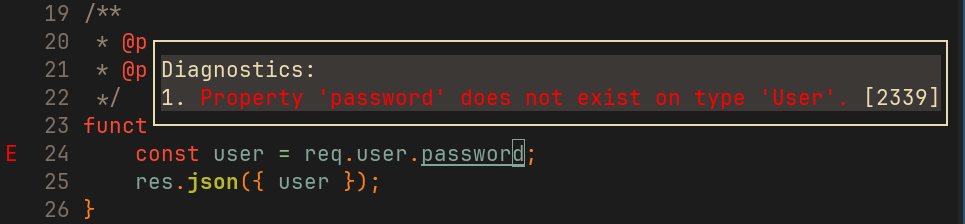
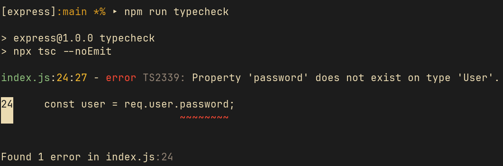

## Setup
1. Install
   ```bash
   npm install
   ```
2. Run
   ```bash
   node index.js
   ```
3. Test
   - cmd
     ```bash
     curl http://localhost:3000/user
     ```
   - response
     ```json
     {
       "user": {
         "userId": "123",
         "username": "jsdoc-fan",
         "refreshTokenVersion": 1
       }
     }
     ```
4. Run typecheck với tsc (yêu cầu cài đặt typescript global hoặc devDeps)

## Typecheck
- Sử dụng editor như VSCode, WebStorm hoặc Neovim (có typescript-language-server) để được gợi ý kiểu dữ liệu tự động.
- Khi code, IDE sẽ tự động nhận biết kiểu của `req.user` nhờ JSDoc và file `types.d.ts`.
- Có thể kiểm tra kiểu dữ liệu bằng lệnh:
  ```bash
  npx tsc --noEmit
  ```
  Nếu có lỗi kiểu dữ liệu, TypeScript sẽ báo ngay trên terminal.

5. Screenshots

> Autocompletion & Linting dựa trên types.d.ts




> Typecheck with `npm run typecheck`


